# Agentic growth system map

```mermaid
flowchart LR
    classDef live fill:#0c6b58,color:#fff,stroke:#65dfc2,stroke-width:2px
    classDef release fill:#174d78,color:#fff,stroke:#82c5ff,stroke-width:2px
    classDef gate fill:#624619,color:#fff,stroke:#f3c76c,stroke-width:2px
    classDef blocked fill:#642f3e,color:#fff,stroke:#ff9cb3,stroke-width:2px

    subgraph DISCOVERY["1. Discovery — live"]
      D1["Landing + SEO pages"]:::live
      D2["MCP Registry · Glama · Smithery"]:::live
      D3["Pay.sh · x402scan · Awesome MCP"]:::live
    end

    subgraph ACTIVATE["2. Activate — release candidate"]
      A1["One-click first live BTC-USD price"]:::release
      A2["Stable privacy-safe agent identity"]:::release
      A3["50 starter credits → explicit 402"]:::live
    end

    subgraph INTEGRATE["3. Integrate — validated in repository"]
      I1["LangChain · LlamaIndex · OpenAI Agents"]:::release
      I2["Vercel AI SDK · GOAT · Solana Agent Kit"]:::release
      I3["Shared clients preserve source + timestamp"]:::release
    end

    subgraph SERVE["4. Production data plane — live"]
      S1["Blocksize market data APIs"]:::live
      S2["MCP + HTTP/x402 delivery"]:::live
      S3["Receipts · provenance · usage events"]:::live
    end

    subgraph MEASURE["5. Growth loop — live"]
      M1["Activation + time-to-first-price"]:::live
      M2["7-day repeat + starter-to-paid"]:::live
      M3["Unsupported-symbol demand + platform coverage"]:::live
    end

    subgraph RWA["6. RWA evidence lane — monitored, not promoted"]
      R1["AAPL: Hyperliquid venue API"]:::live
      R2["PAXG: Ethereum RPC · EURC: Base RPC"]:::live
      R3["30-min replay + queryable candidate ledger"]:::release
      R4["14 days · 672 samples · ≥99% success/freshness"]:::gate
      R5["Benchmark · depth · independence · rights"]:::blocked
      R6["Named human promotion approval"]:::blocked
    end

    D1 --> A1
    D2 --> A1
    D3 --> A1
    A1 --> A2 --> A3 --> I1
    A3 --> I2
    I1 --> I3 --> S1
    I2 --> I3
    S1 --> S2 --> S3 --> M1
    M1 --> M2 --> M3 --> D1
    S1 --> R1
    S1 --> R2
    R1 --> R3
    R2 --> R3
    R3 --> R4 --> R5 --> R6
```

Status meaning: green is functioning in production before this release; blue is implemented and locally validated in the pending release; amber is an elapsed-time/data threshold; red requires external evidence or named human approval.
