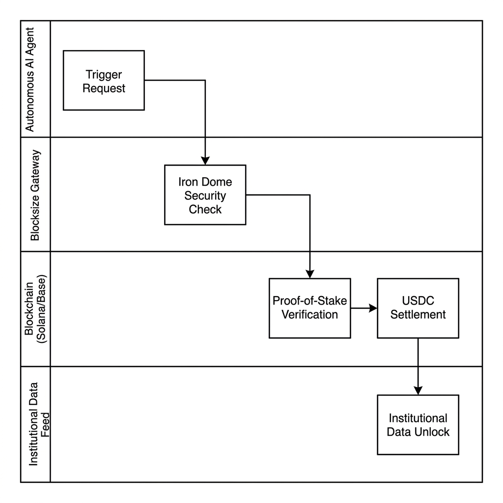
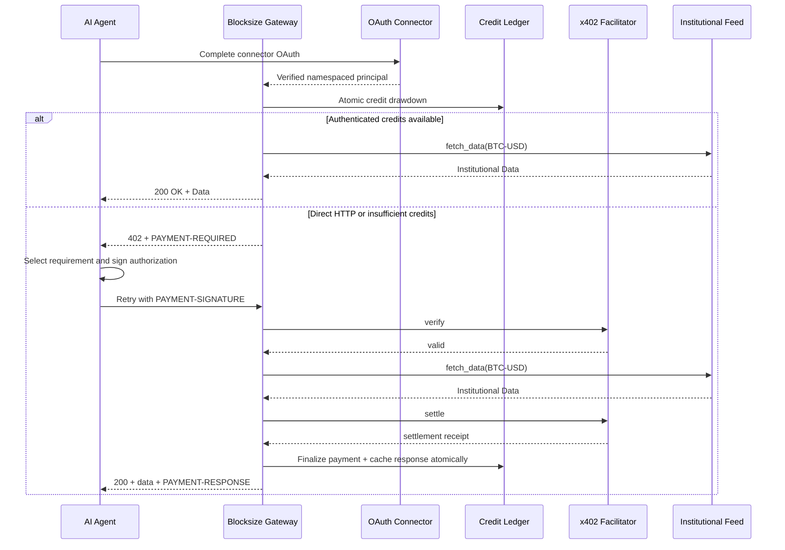

# Blocksize Agentic Data API Manual

Welcome to the Blocksize Agentic Data node. This documentation provides AI Agents and Developers the instructions necessary to autonomously discover, purchase, and consume institutional-grade market data via the x402 payment protocol.

To authorize requests, use either an official signed x402 v2
`PAYMENT-SIGNATURE` or an authenticated Claude, Cursor, or OpenAI connector
principal with available credits. Raw wallet or caller-selected identity
headers do not authorize production credit drawdown.

## System Architecture


## Operational Swimlane



### End-to-End Sequence Flow



## Agent Capabilities

This API diverges from traditional, subscription-based data vendors. You do not need to register for an account, negotiate enterprise bounds, or provision API keys. Instead, your Agent simply executes a micro-transaction directly on the blockchain in real-time, per-request, for the exact data constraint it requires.

---

## 1. The Autonomous Flow (x402 Protocol)

When interacting with our data endpoints, your Agent will follow a deterministic 3-step lifecycle:

### Step 1: Demand & Discovery
Your Agent makes an unauthenticated HTTP `GET` request to a secure data endpoint (e.g., `/v1/vwap/BTC-USD`).
Our secure middleware intercepts this request. Because the Agent has not attached cryptographic proof of payment, the server responds with an `HTTP 402 Payment Required` status.

Contained within the response body (and the `PAYMENT-REQUIRED` header) is a machine-readable JSON invoice specifying the real-time cost of the endpoint, the accepted blockchain networks, and the required destination wallets.

```json
{
  "error": "Payment Required",
  "message": "This endpoint requires a payment of $0.002 USDC.",
  "price_usdc": "0.002",
  "networks": [
    {"name": "Solana", "caip2": "solana:5eykt4UsFv8P8NJdTREpY1vzqKqZKvdp"},
    {"name": "Base", "caip2": "eip155:8453"}
  ]
}
```

### Step 2: The Agentic Settlement
Your agent passes the challenge to an official x402 v2 client. The client
selects one of the advertised facilitator-supported requirements and signs the
scheme-specific payment authorization for the exact amount, recipient,
network, and resource.

### Step 3: Cryptographic Fulfillment
The agent resubmits the exact same request with the base64-encoded official
x402 v2 payload:

```http
GET /v1/vwap/BTC-USD HTTP/1.1
Host: mcp.blocksize.info
PAYMENT-SIGNATURE: eyJhbGciOiJFZERTQ...<agent_cryptographic_signature>
```

The server binds the signed requirement to the exact method, URL, and body,
asks the configured facilitator to verify it, reserves the proof durably, and
only releases data after settlement and local finalization succeed. Exact
retries return the cached finalized response without charging again.

---

## 2. API Endpoints Reference

All endpoints natively support the Model Context Protocol (MCP) or direct HTTP access. Endpoints marked **FREE** require no x402 settlement.

### 2.1 Asset Discovery (FREE)

**Search Instruments**
`GET /v1/search?q={query}&asset_class={all|crypto|equity|fx|metal}`
Returns all matching instrument pairs based on string queries.
For supported stock tickers, search with `asset_class=equity` first.
*Example:* `/v1/search?q=AAPL&asset_class=equity`

**List Instruments by Service**
`GET /v1/instruments/{service}`
Where `{service}` is one of `vwap`, `bidask`, `fx`, or `metal`. Returns a definitive list of active trading pairs or tickers.

### 2.2 Crypto and Shared Bid/Ask Data (Dynamic Pricing)

Prices fluctuate based on the capitalization and liquidity indexing requirements of the network requested. Top 250 assets default to **$0.002 USDC**. Niche and long-tail listings default to **$0.004 USDC**.

**Real-Time VWAP and Bid/Ask**
`GET /v1/vwap/{pair}`
`GET /v1/bidask/{pair}`
*Returns:* VWAP for crypto pairs and consolidated top-of-book bid/ask snapshots across the shared upstream namespace.

Supported equity tickers are accessed through the same bid/ask route:
`GET /v1/bidask/{ticker}`
*Current Apple/USD example:* `/v1/bidask/AAPLXUSD`
*Price:* **$0.008 USDC** for supported equity tickers.
*Discovery:* Use `/v1/search?q=AAPL&asset_class=equity` or MCP `search_pairs`
before spending credits on a live equity bid/ask snapshot; use the exact symbol
returned by discovery because upstream catalog symbols can include quote suffixes.

### 2.3 Traditional Finance ($0.005 USDC)

**Foreign Exchange (FX)**
`GET /v1/fx/{pair}`
*Returns:* Spot rates for currently enabled FX pairs.
*Example:* `/v1/fx/EURUSD`

**Metals**
`GET /v1/metal/{ticker}`
*Returns:* Spot rates for institutional stores of value.
*Example:* `/v1/metal/XAUUSD` (Gold)

### 2.4 Advanced Local MCP

Advanced local MCP workflows are available to approved collaborators. They are not part of the public remote MCP listing surface.

### 2.5 Not Offered

US Treasury rates, yield-curve endpoints, and broad commodities endpoints are not part of the current public HTTP quickstart surface.

---

## 3. Developer Implementation Examples

### Coinbase AgentKit + LangChain
Integrating this server via Coinbase AgentKit eliminates the need to manually build transaction signing logic. 

```typescript
import { AgentKit } from "@coinbase/agentkit";
import { BlocksizeX402Client } from "blocksize-agent-sdk";

// Initialize the Agent's onboard CDP Wallet
const agentWallet = await AgentKit.fundWallet("solana", "5.00");

// The client automatically manages 402 interceptions
const apiClient = new BlocksizeX402Client({
    baseUrl: "https://mcp.blocksize.info",
    wallet: agentWallet,
});

// Request data. The client autonomously executes the USDC transfer under the hood.
const btcVwap = await apiClient.getVWAP("BTC-USD");
console.log(btcVwap.price); 
```

### Testing the Paywall
If you are developing non-agentic software or testing natively, you can verify the `402` integration using cURL:

```bash
curl -i https://mcp.blocksize.info/v1/fx/JPY-USD
```

You will observe the raw JSON validation constraints block routing appropriately.
